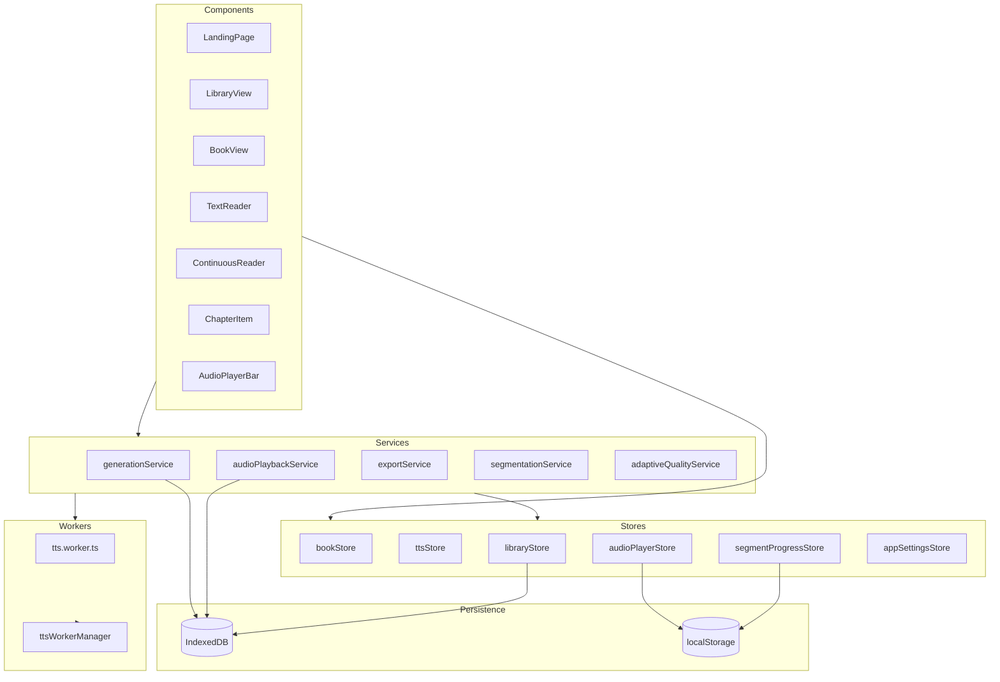
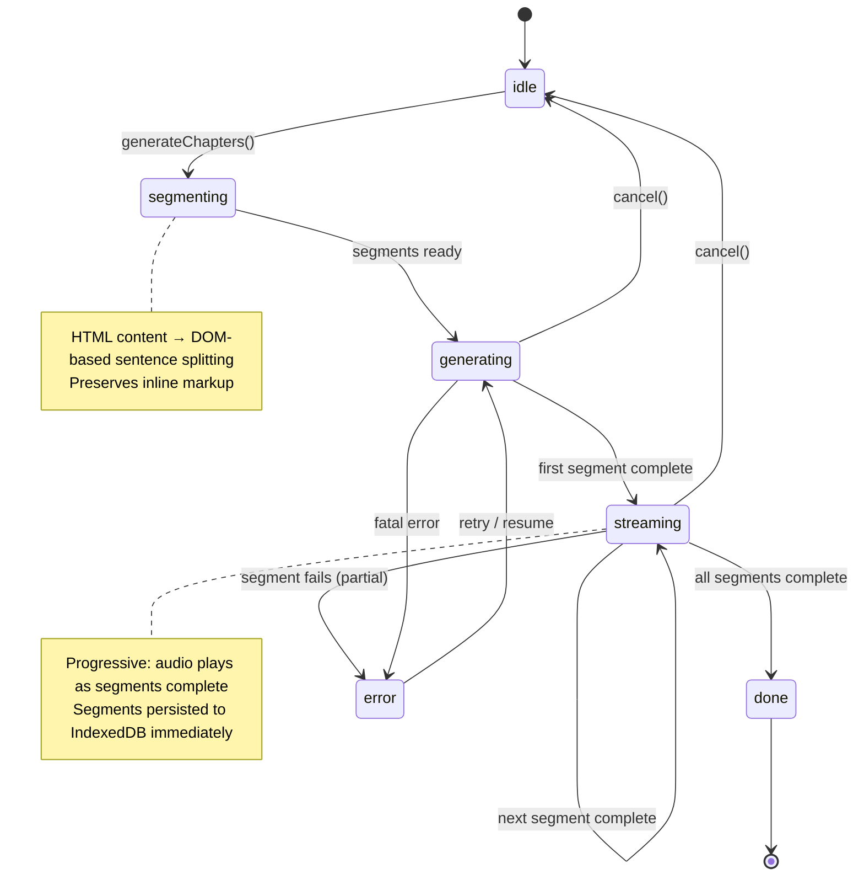

# Architecture

## System Overview



## Generation Pipeline State Machine



### State Descriptions

| State        | Description                                                                 |
| ------------ | --------------------------------------------------------------------------- |
| `idle`       | No generation in progress                                                   |
| `segmenting` | HTML content being split into sentences via DOM parser                      |
| `generating` | TTS worker processing segments (parallel batches based on `parallelChunks`) |
| `streaming`  | Audio segments playing progressively as they complete                       |
| `done`       | All segments generated and persisted                                        |
| `error`      | One or more segments failed; partial results preserved for retry            |

## Playback Modes

| Mode            | Description                                                     | When Used                          |
| --------------- | --------------------------------------------------------------- | ---------------------------------- |
| **Merged**      | Single concatenated audio file with time-based segment tracking | After export or full concatenation |
| **Progressive** | Per-segment blobs chained sequentially as generation completes  | During active generation           |
| **On-demand**   | Generate segment on click, buffer ahead N segments              | Click-to-play in TextReader        |

The `audioPlaybackService` handles all three modes transparently. It falls back from merged → progressive → on-demand based on what audio data is available.

## Store ↔ Service Relationships

| Service                | Reads from                                  | Writes to                                                     |
| ---------------------- | ------------------------------------------- | ------------------------------------------------------------- |
| `generationService`    | `ttsStore`, `bookStore`, `appSettingsStore` | `bookStore` (status, progress, audio), `segmentProgressStore` |
| `audioPlaybackService` | `audioPlayerStore`, `segmentProgressStore`  | `audioPlayerStore`                                            |
| `exportService`        | `bookStore` (generatedAudio), `libraryDB`   | File download (browser)                                       |
| `segmentationService`  | —                                           | Returns segmented HTML + text segments                        |
| `generationStateStore` | `localStorage`                              | `localStorage` (crash recovery)                               |
| `segmentBatchHandler`  | —                                           | `libraryDB` (IndexedDB), `segmentProgressStore`               |

## Svelte 5 Runes Usage

This project uses Svelte 5 runes for reactive state:

### Pattern: Service classes with `$state` and `$effect`

```typescript
// src/lib/audioPlaybackService.svelte.ts
class AudioPlaybackService {
  // Reactive state — triggers UI updates automatically
  isPlaying = $state(false)
  currentSegmentIndex = $state(-1)
  currentTime = $state(0)
  segments = $state<TextSegment[]>([])

  constructor() {
    // Root effect for store synchronization
    $effect.root(() => {
      $effect(() => {
        // Runs when reactive state changes
        if (this.currentSegmentIndex >= 0) {
          audioPlayerStore.updatePosition(...)
        }
      })
    })
  }
}

// Singleton export
export const audioService = new AudioPlaybackService()
```

### Pattern: Component props with `$props` and `$derived`

```svelte
<script lang="ts">
  // $props replaces 'export let' from Svelte 4
  let { chapter, bookId, onBack } = $props()
  // $derived replaces '$:' reactive declarations
  let wordCount = $derived(countWords(chapter.content))
</script>
```

### Key Conventions

- **`.svelte.ts` extension** — files using runes outside components must use this extension
- **`$state`** — mutable reactive state (replaces `let` reactivity from Svelte 4)
- **`$derived`** — computed values (replaces `$:` reactive declarations)
- **`$effect`** — side effects on state change (replaces `$:` reactive statements)
- **`$props`** — typed component props (replaces `export let`)
- **Stores (`writable`)** — still used for cross-component shared state; runes for component-local and service-internal state

## Key Architectural Decisions

1. **Lazy imports** — Heavy modules (ONNX, FFmpeg, Piper) are dynamically imported to keep initial bundle small
2. **Web Worker for TTS** — All inference runs off-main-thread to keep UI responsive
3. **Segment-based persistence** — Each audio segment saved individually to IndexedDB (not full chapter blobs) for OOM resilience
4. **Progressive playback** — Audio starts playing before full chapter is generated
5. **Worker restart for OOM** — TTS worker terminated periodically to reclaim WASM heap memory (every chapter on mobile, every 3 on desktop)
6. **Crash recovery** — Generation state persisted to localStorage; interrupted sessions can resume
